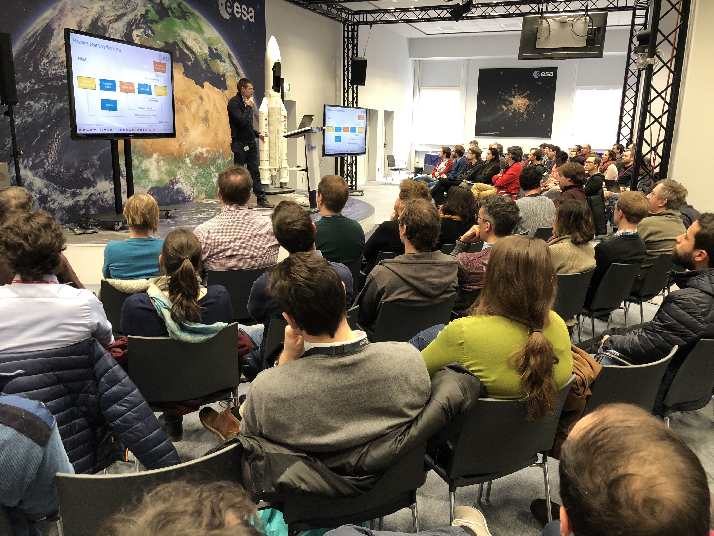

# 2018-MachineLearning-Lectures-ESA

**[Español]** Estoy poniendo los contenidos de estas charlas en español en [IArtificial.net](https://iartificial.net)

In 2018, The European Space Agency (ESA) organized a series of 6 lectures on Machine Learning at the European Space Operations Centre (ESOC).
This repository contains the lectures resources: presentations, notebooks and links to the videos (presentation and hands-on).

The topics covered are:
1. **Machine Learning Introduction**
    * presentation: [video](https://www.youtube.com/watch?v=FXYPDyoR1o0)  [slides](https://github.com/jmartinezheras/2018-MachineLearning-Lectures-ESA/blob/master/1_Introduction/1_MachineLearningIntroduction.pdf)
2. **Linear Regression and Support Vector Machines**
    * presentation: [video](https://www.youtube.com/watch?v=_5lsmWpA5IU) [slides](https://github.com/jmartinezheras/2018-MachineLearning-Lectures-ESA/blob/master/2_LinearRegression_SVM/2_LinearRegression_SVM.pdf)
    * hands-on: [video](https://youtu.be/9WisRGpP4p4) [notebook](https://github.com/jmartinezheras/2018-MachineLearning-Lectures-ESA/blob/master/2_LinearRegression_SVM/2_airbnb_frankfurt.ipynb)
3. **Decision Trees and Random Forests**
    * presentation: [video](https://youtu.be/Op4thnw-ig8) [slides](https://github.com/jmartinezheras/2018-MachineLearning-Lectures-ESA/blob/master/3_DecisionTrees-RandomForests/3_DecisionTrees-RandomForests.pdf)
    * hands-on: [video](https://youtu.be/HuD6myqJcFU) [notebook](https://github.com/jmartinezheras/2018-MachineLearning-Lectures-ESA/blob/master/3_DecisionTrees-RandomForests/3_bank.ipynb)
4. **Neural Networks and Deep Learning**
    * presentation: [video](https://dlmultimedia.esa.int/download/public/videos/2048/03/008/4803_008_AR_EN.mp4) [slides](https://github.com/jmartinezheras/2018-MachineLearning-Lectures-ESA/blob/master/4_NN-DeepLearning/4_NN-DeepLearning.pdf)
    * hands-on: [video](https://dlmultimedia.esa.int/download/public/videos/2048/03/007/4803_007_AR_EN.mp4) [notebook](https://github.com/jmartinezheras/2018-MachineLearning-Lectures-ESA/blob/master/4_NN-DeepLearning/4_HandWrittenRecognition-CNN.ipynb)
    * bonus: [Introduction to GANs](https://github.com/jmartinezheras/2018-MachineLearning-Lectures-ESA/blob/master/4_NN-DeepLearning/4_GANs_Intro.pdf)
5. **Unsupervised Learning**
    * presentation: [video](https://dlmultimedia.esa.int/download/public/videos/2048/04/011/4804_011_AR_EN.mp4) [slides](https://github.com/jmartinezheras/2018-MachineLearning-Lectures-ESA/blob/master/5_UnsupervisedLearning/5_UnsupervisedLearning.pdf)
    * hands-on: [video](https://dlmultimedia.esa.int/download/public/videos/2048/04/010/4804_010_AR_EN.mp4) [notebook](https://github.com/jmartinezheras/2018-MachineLearning-Lectures-ESA/blob/master/5_UnsupervisedLearning/5_Unsupervised_DowJones.ipynb) 
6. **Text Mining**
    * presentation: [video](https://dlmultimedia.esa.int/download/public/videos/2048/04/013/4804_013_AR_EN.mp4) [slides](https://github.com/jmartinezheras/2018-MachineLearning-Lectures-ESA/blob/master/6_TextMining/6_TextMining.pdf)
    * hands-on: [video](https://dlmultimedia.esa.int/download/public/videos/2048/04/012/4804_012_AR_EN.mp4) [notebook](https://github.com/jmartinezheras/2018-MachineLearning-Lectures-ESA/blob/master/6_TextMining/6_TextMining-ESA-News.ipynb)

&nbsp;

